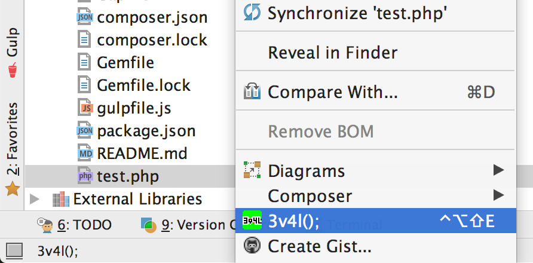

# 1d34-3v4l-pl4g1n

The plugin allows you to run your code on more than 150 different PHP versions using [3v4l.org](https://3v4l.org/).
Read more about the website [here](https://3v4l.org/about) and support its author if you like the idea.

## Usage

To execute a PHP script you just have to right click on the file and select "3v4l();" from the menu. You could also 
use the keyboard command `Ctrl + Alt + Shift + E` (default). The plugin will open your browser with the result
of the script on the 3v4l.org website.
